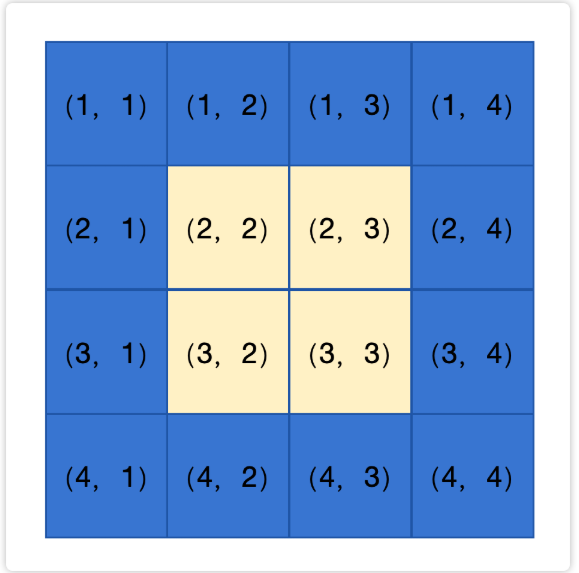
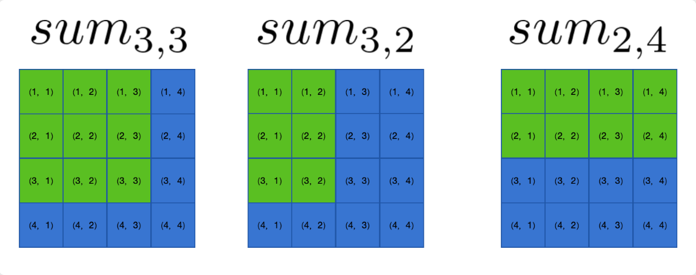
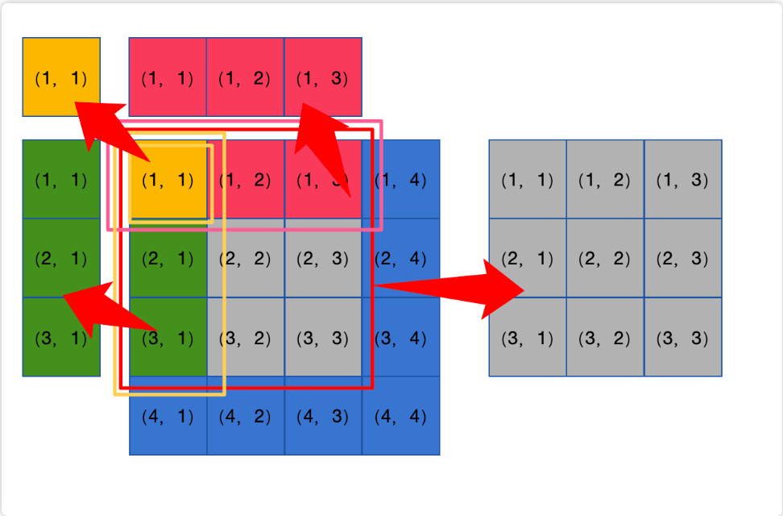
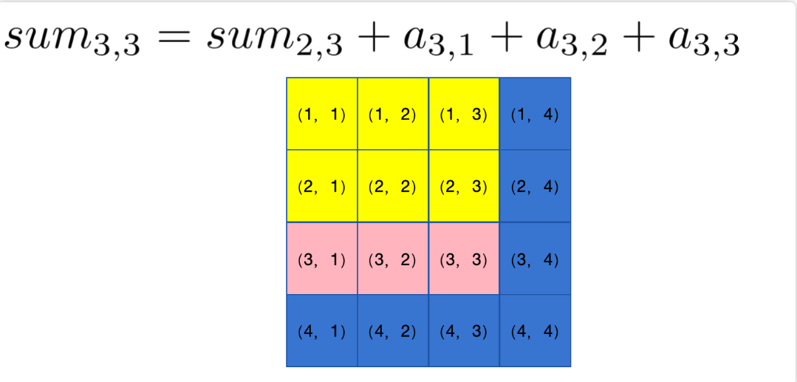

# 关于二维前缀和
一维的前缀和求的只是一排序列的和值，宏观上看，是一条线段、一段区间。

但是二维的前缀合求的是一个矩形的和值，我们用图来表示，假设存在一个二维数组 a[i][j]从（1,1）到（4,4）。  
    
我们通常用二维前缀和去求中间矩形和的值  
## 二维前缀数组   
我们定义前缀和数组 $sum_{i,j}$ 为从 $(1,1) \sum (i,j)$ 的和值，例如下图：  

---

### 如何快速求解？

那么如何快速求解从 $(2,2) \sim (3,3)$ 的和值呢？

我们利用一下 **容斥原理** 的思想，可以得到：

$$
sum_{(2,2) \sim (3,3)} = sum_{3,3} - sum_{1,3} - sum_{3,1} + sum_{1,1}
$$

我们用图表表示：  
  
可以看到，我们尝试从灰色的部分剥离出多余的矩形，但是当减去了红色和绿色的部分后，发现黄色的部分被多减去了一次，因此需要加回来。

### **那么如何求维护二维前缀和呢？**

我们用递推的思想，假设我们要求 $sum_{n,m}$，我们已经知道了 $sum_{n-1,m}$，那么我们可以用 $\sum_{i=1}^{j} a_{n,i} + sum_{n-1,j}$ 求出 $sum_{n,m}$，如图：

$$
sum_{3,3} = sum_{2,3} + a_{3,1} + a_{3,2} + a_{3,3}
$$

我们可以用循环技巧在 $O(n \times m)$ 的复杂度内求出所有的二维前缀和。代码将在下一节中给出。

> **当然，也可以用容斥的思想：**
> $$sum_{n,m} = sum_{n-1,m} + sum_{n,m-1} - sum_{n-1,m-1} + a_{n,m}$$
> 只不过上述方式更加常用。
